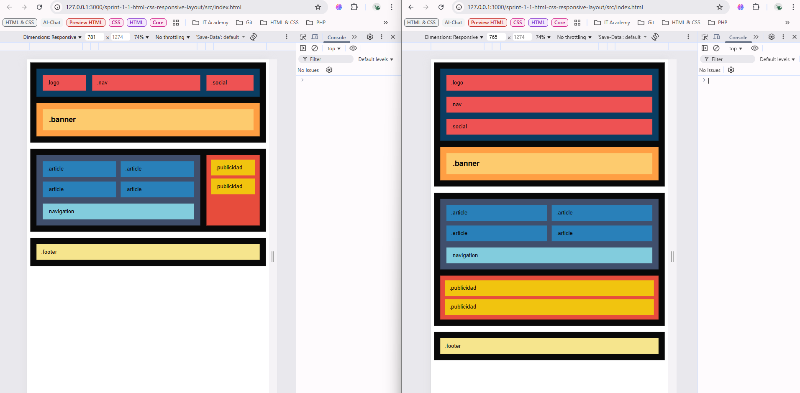

# Sprint 1: Web Layout and PHP
  **Description**: In this practice (S1.01) we will have to make a Layout that must work on both desktop, mobile and tablet.

  ## 🛠 Technologies
  - Frontend: HTML, CSS
  - Backend: Not Applicable (N/A) at this theme/stage (S1.01).

  ## 🚀 Installation
  1. Clone the repository: `git clone https://github.com/fdesouzabcn/sprint-1-1-html-css-responsive-layout.git`
  2. Install dependencies: N/A
  3. Environment Variables: N/A

  ## 📸 Demo
  Nivel 1 - Exercise 1 - Maquetacion Desktop (≤1200px)
  

  Nivel 1 - Exercise 2 - Responsive a Tablet (≤768px)
  

  Nivel 1 - Exercise 3 - Responsive a Small Devices (≤480px)
 